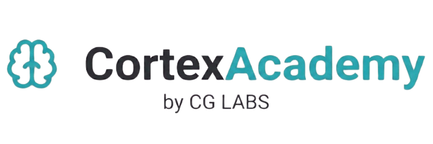
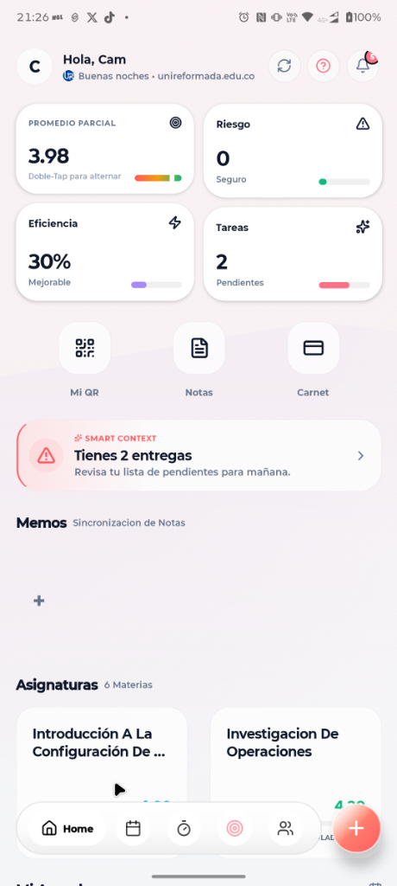
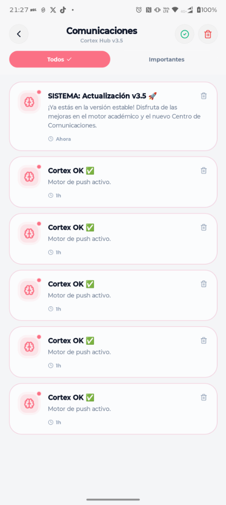
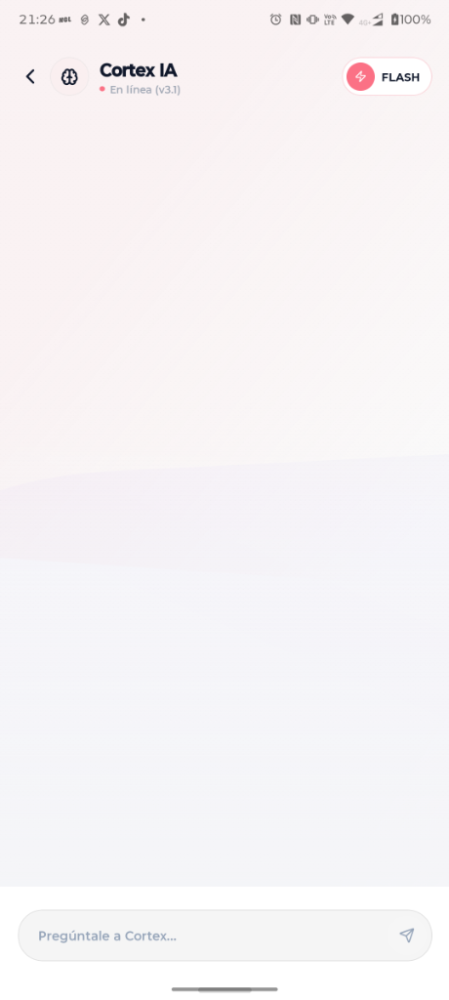

# Cortex Academy: La Nueva Era de la Educación de Élite

  

---

## 📸 Capturas de Pantalla

| Dashboard Matte OS | Cortex IA (v3.1) | Comunicaciones (v3.5) |
| :---: | :---: | :---: |
|  |  |  |

---

## 🚀 Punto de Distribución
Esta es la versión **Industrial Beta** de Cortex Academy. El despliegue se realiza de forma independiente para garantizar la máxima velocidad de actualización y personalización.

- 📥 **Descarga Directa (.APK)**: Disponible en la [Matrix Landing Page](https://github.com/cgus392/CortexAcademyApp/releases/tag/v1.0.0-INDUSTRIAL)
- 🛰️ **Distribución**: GitHub Releases (cgus392)

---

## 🏛️ Características de Élite
- **Nexus AI**: Asistente inteligente integrado con visión académica.
- **Matte OS UI**: Sistema de diseño basado en widgets sólidos y minimalistas.
- **Academic Hub**: Centralización de notas, tareas y eventos en tiempo real.
- **Gamificación**: Sistema de progresión y recompensas basado en desempeño.

---

## 🛠️ Tecnologías
- **Core**: React Native + Expo Managed Workflow
- **State**: Redux Toolkit / Context API
- **UI**: Tailwind CSS (NativeWind) + Reanimated
- **Backend**: Firebase (Auth, Firestore, Cloud Functions)

---

> [!IMPORTANT]
> **Cortex Academy** es un entorno de software propietario desarrollado por **CG LABS**. Todos los derechos reservados. 🛡️
