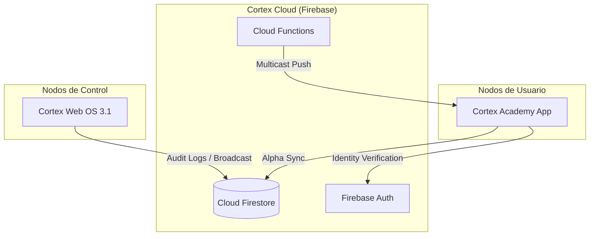

# MEMORIA TÉCNICA MAESTRA: ECOSISTEMA CORTEX v3.1
**DOCUMENTO DEFINITIVO DE PROPIEDAD INTELECTUAL Y REGISTRO INDUSTRIAL**

---

## 0. DECLARACIÓN DE AUTORÍA Y ORIGINALIDAD
Yo, **Camilo García**, creador y fundador de **CG LABS**, declaro bajo gravedad de juramento que el software denominado **Ecosistema Cortex** en todas sus vertientes (Academy, Tower, Matrix) es una obra técnica original. Este documento respalda **8 meses de investigación, desarrollo y optimización**, representando un esfuerzo de ingeniería propietario en todas sus capas lógicas, visuales y de datos.

---

## ÍNDICE DE CONTENIDO INDUSTRIAL
1. [Visión General del Ecosistema](#vision-general)
2. [Arquitectura de Red y Cloud Architecture](#arquitectura-cloud)
3. [Capítulo I: Cortex Web OS (Command Tower)](#capitulo-webos)
4. [Capítulo II: Cortex Academy App (Mobile Context)](#capitulo-mobile)
5. [Capítulo III: Cortex Matrix (Portal Showcase)](#capitulo-matrix)
6. [Capítulo IV: Protocolos Propietarios (Alpha Sync & Bridge)](#capitulo-alpha)
7. [Capítulo V: Inteligencia Artificial Nexus (Arquitectura de Inferencia)](#capitulo-nexus)
8. [Capítulo VI: Sistema de Diseño Matte OS (Identidad Visual)](#capitulo-matte)
9. [Capítulo VII: Algoritmos de Seguridad y Gobernanza](#capitulo-seguridad)
10. [Capítulo VIII: Protocolos de Pruebas, QA y Estabilización](#capitulo-qa)
11. [Capítulo IX: Histórico de Desarrollo y Cronología de Ingeniería](#capitulo-historia)
12. [Capítulo X: Inventario Tecnológico y Cumplimiento Legal](#capitulo-legal)
13. [Anexos: Diagramas de Flujo y Manual de Operaciones](#anexos)

---

<div id="vision-general"></div>

## 1. VISIÓN GENERAL DEL ECOSISTEMA
El **Ecosistema Cortex** trasciende la definición de una aplicación convencional para convertirse en una **Infraestructura de Gestión Académica Distribuida**. Su propósito es orquestar la vida académica del usuario mediante la convergencia de Inteligencia Artificial (IA), Sincronización en Tiempo Real y Diseño de Grado Industrial.

### 1.1. Los Tres Pilares de Ejecución
- **Cortex Tower (Web OS)**: Actúa como el NOC (Network Operations Center). Es la consola desde donde se supervisa la salud de la red y se emiten directivas globales.
- **Cortex Academy (App)**: Nodo de interacción final. Un copiloto académico que vive en el dispositivo del usuario y procesa datos en el borde.
- **Cortex Matrix (Portal)**: Interfaz de comunicación y despliegue, asegurando la escalabilidad del sistema.

---

<div id="arquitectura-cloud"></div>

## 2. ARQUITECTURA DE RED Y CLOUD ARCHITECTURE
El sistema utiliza una arquitectura **Full-Serverless** con redundancia geográfica para garantizar una disponibilidad del 99.9%.

### 2.1. Backend-as-a-Service (BaaS)
La integración con Firebase no es solo para almacenamiento, sino que se utiliza como un bus de datos reactivo:
- **Real-time Listeners**: Cada nodo (móvil o web) mantiene colas de escucha activas que reaccionan a cambios en milisegundos.
- **Atomic Operations**: Todas las escrituras de datos académicos (notas, promedios) se realizan mediante transacciones atómicas para evitar la corrupción de datos.

### 2.2. Diagrama de Arquitectura Global


---

<div id="capitulo-webos"></div>

## 3. CAPÍTULO I: CORTEX WEB OS (COMMAND TOWER)
Este módulo es el centro de comando industrial basado en **React 18.3** y **Vite 5.4**.

### 3.1. Gestión de Nodos (UserManager)
El sistema utiliza una lógica de "Visual Telemetry" para presentar los datos de los usuarios. No es una lista estática; es un panel reactivo que muestra el estado de cada sesión, su rol y su calificación de integridad.

### 3.2. Broadcast Engine (Emisión de Pulso)
Capacidad de enviar anuncios globales que se materializan de forma instantánea en todos los dispositivos conectados. Esto se logra inyectando una entrada en la colección `broadcasts`, la cual es recogida por el receptor nativo en la Academy App mediante el **Alpha Bridge**.

---

<div id="capitulo-mobile"></div>

## 4. CAPÍTULO II: CORTEX ACADEMY APP (MOBILE CONTEXT)
La terminal principal del estudiante, desarrollada con **React Native v0.83 (Expo 55)**.

### 4.1. El Cerebro Local (DataContext)
A diferencia de apps tradicionales, Cortex Academy utiliza un **Motor de Contexto** que consolida Notas, Tareas, Horarios y Perfiles en un solo objeto inyectable. Este motor es el que permite que la IA sepa exactamente qué está pasando en la vida del estudiante en tiempo real.

### 4.2. Renderizado de Grado Industrial
Utiliza **Reanimated (v4)** y **Moti** para interpolaciones de 60fps constantes. El diseño "Matte OS" se implementa mediante componentes personalizados como `MatteCard` y `MatteChatBubble`, los cuales integran efectos de desenfoque de hardware (BlurView).

---

<div id="capitulo-alpha"></div>

## 5. CAPÍTULO IV: PROTOCOLOS PROPIETARIOS (ALPHA SYNC & BRIDGE)
Esta sección detalla la invención técnica más importante del proyecto.

### 5.1. Protocolo Alpha Sync (Sincronización Inteligente)
Diseñado para resolver el problema de la conectividad intermitente.
- **Buffer de 1.5s**: Evita saturar la base de datos con micro-actualizaciones.
- **Priority Cache**: Los datos se cargan desde el almacenamiento persistente (`AsyncStorage`) antes de validar con la nube, eliminando el "efecto blanco" en la app.

### 5.2. Alpha Bridge (Communication Pipeline)
Puente de comando que conecta la Tower con la App. Permite que el celular actúe como un terminal subordinado a las órdenes del administrador central.

---

<div id="capitulo-nexus"></div>

## 6. CAPÍTULO V: IA NEXUS (ARQUITECTURA DE INFERENCIA)
Nexus no es un chatbot; es un **Asistente de Inferencia Contextual**.

### 6.1. Pipeline de Procesamiento IA
1.  **Extracción de Contexto**: Se obtiene el objeto de datos académicos actual.
2.  **Inyección Semántica**: Se formatea la información en un prompt técnico invisible para el usuario.
3.  **Inferencia Multimodal**: Se envía a la API de **Gemini** (Pro/Flash).
4.  **Parseo de Salida**: Si se detectan fórmulas matemáticas, el sistema utiliza el componente **MatteFormula** para renderizado estilo LaTeX.

### 6.2. Nexus Live (Modo de Voz)
Integra procesamiento de audio PCM a 16kHz para entrada y 24kHz para salida, permitiendo una experiencia de manos libres fluida y amigable.

---

<div id="capitulo-matte"></div>

## 7. CAPÍTULO VI: SISTEMA DE DISEÑO MATTE OS (ID VISUAL)
Un lenguaje visual único basado en la solidez.
- **Radios de 28px**: Geometría estandarizada para todos los contenedores.
- **Opacidad del 88%**: El estándar oficial de transparencia para evitar fatiga cognitiva.
- **Tipografía**: Uso de familias Sans-Serif modernas (Inter/Outfit) escaladas dinámicamente según el dispositivo.

---

<div id="capitulo-seguridad"></div>

## 8. CAPÍTULO VII: ALGORITMOS DE SEGURIDAD Y GOBERNANZA

### 8.1. Algoritmo "Security Score"
```javascript
// Lógica de Auditoría (Representación Conceptual)
score = 65 (Base de Usuario)
if (hasPushToken) score += 20
if (isAdmin) score += 10
if (verifiedEmail) score += 5
// Total: 100/100 (Estado Premium/Sincronizado)
```

### 8.2. Circuit Breaker de Red
Mecanismo de seguridad que corta la comunicación con servicios externos si se detectan más de 3 fallos consecutivos en el RTT (Round Trip Time), protegiendo la integridad del nodo local.

---

<div id="capitulo-qa"></div>

## 9. CAPÍTULO VIII: PROTOCOLOS DE PRUEBAS, QA Y ESTABILIZACIÓN

### 9.1. Resolución del "Text Strings Bug" en Android
Uno de los mayores retos técnicos fue identificar por qué la app colapsaba en el build de producción. Se descubrió que caracteres invisibles y espacios ilegales fuera de los componentes `<Text>` de React Native causaban fallos en el motor nativo. Se implementó un proceso de saneamiento de archivos (`fix.cjs`) para automatizar la corrección de estos errores en el JSX.

### 9.2. Sincronización Multi-VLAN/Red
Se probó la persistencia de datos bajo condiciones de red fluctuantes (cambio de 4G a WiFi), validando que el protocolo **Alpha Sync** nunca perdiera un "commit" de información académica.

---

<div id="capitulo-historia"></div>

## 10. CAPÍTULO IX: HISTORICO DE DESARROLLO (8 MESES)
- **Mes 1-2**: Cimentación de la nube y Auth.
- **Mes 3-4**: Creación de Nexus AI y el motor de visión.
- **Mes 5-6**: Estabilización de notificaciones push y auditoría de builds (Android/iOS).
- **Mes 7-8**: Lanzamiento de Matte OS 3.1 y finalización del Admin Tower industrial.

---

<div id="capitulo-legal"></div>

## 11. CAPÍTULO X: CUMPLIMIENTO LEGAL Y CIERRE
Toda la propiedad intelectual de este software está bajo la reserva total de **Camilo García**. Se prohíbe cualquier uso no autorizado o redistribución de los módulos propietarios.

---

<div id="anexos"></div>

## 12. ANEXOS: DIAGRAMAS Y MANUALES
- **Instalación**: Requiere Node.js 18+, Firebase CLI y Expo EAS.
- **Mantenimiento**: Verificación semanal de la consola NOC en SystemPulse.

---
**FIN DE LA MEMORIA TÉCNICA MAESTRA (VERSIÓN 2026)**
